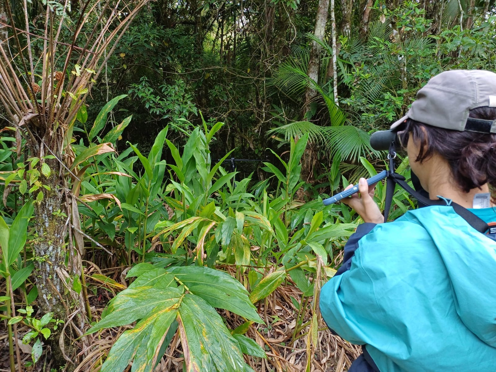

::: {#hero-heading}
Welcome to my website! My name is Renata and I am a PhD candidate in Ecology and Evolutionary Biology at the University of Tennessee, Knoxville. I am part of the [Derryberry lab](https://derryberrylab.wordpress.com/), where I study the evolution of bird communication in female antbirds.

During my free time, I like to [crochet birds](https://www.instagram.com/renatabeco/) and go for hikes to bird (of course!). I post my bird lists on [eBird](https://ebird.org/profile/OTQwNzc0) and use [iNaturalist](https://www.inaturalist.org/people/2317238) to post all other cool non-bird organisms.
:::

------------------------------------------------------------------------

